## Introduction {.smaller}

**Objective:** Forecasting the Home Health market basket can support
financial planning, inform strategic decision making, and help
organizations anticipate implications for cost‑of‑care management. This
project applies classical time‑series methods to model and forecast the
CMS Home Health Market Basket Index.

Time‑series methods, particularly ARIMA models have been widely applied
in healthcare economics to forecast medical expenditures, inflation, and
service demand. Prior studies have demonstrated that ARIMA based
approaches perform well in modeling healthcare spending and medical
price behavior, including forecasting national health expenditures
@dritsakis2019time, providing broad overviews of health forecasting
methodologies @soyiri2013overview, and predicting medical service demand
using hybrid ARIMA‑based models @huang2020medical.

## What is a Time Series? {.smaller}

A **Time Series** is a collection of observations $x_t$ made sequentially in
time $T_0$. Studying models that incorporate dependence is the key
concept in time series analysis @cryer_chan_2010.

In general, the goal is to emphasize plotting methods that are
appropriate and useful for finding patterns that will lead to suitable
models for our time series data. Finding an appropriate model allows us
to then forecast future values based on past-behavior.

## What is a Time Series? {.smaller}

**Discrete-Time Series:** Observations are recorded at distinct, evenly
spaced time point. Examples include: annual temperature, quarterly
economic indicators.

**Continuous-Time Series:** Collection of observations that are made
continuously over some time interval. For example: network traffic
measured in real time.

The CMS Home Health Market Basket is observed quarterly, meaning the
data occurs at fixed, evenly spaced intervals. Since the time series
advances in discrete steps, all models evaluated in this study are
formulated within a discrete time series stochastic process framework.

## Finding an Appropriate Model {.smaller}

There are three main steps in the process of finding an appropriate
model:

Model Specification (Identification)

Model Fitting

Model Diagnostics

## Stationarity and Time Series Foundations {.smaller}

A process $\{Y_t\}$ is **strictly stationary** if the joint distribution of
$(Y_{t_1}, \ldots, Y_{t_n})$ is the same as the joint distribution of
$(Y_{t_1-h}, \ldots, Y_{t_n-h})$ for all choices of time points
$t_1,\ldots,t_n$ and all choices of time lag $h$.

$$
f(Y_{t_1}, \ldots, Y_{t_n}) = f(Y_{t_1-h}, \ldots, Y_{t_n-h})
$$

## Weak Stationarity {.smaller}

A process $\{Y_t\}$ is **weakly stationary** if it satisfies that following
conditions:

$$ E(Y_t) = \mu $$ $$Var(Y_t) = \sigma^2$$

$$\gamma_{t,t-k} = \gamma_k$$

Weak stationarity is sufficient for ARMA and ARIMA models because they
assume that the underlying statistical process is stable over time.

## Non-Stationarity and White Noise {.smaller}

However, most data sets are **non-Stationary:** without constant mean over
time, and must be transformed. After removing systematic components of a
non-stationary series, the remaining series should resemble **white noise:**
a sequence of independent, identically distributed random variables.

```{r}
wn <- rnorm(500)  
plot.ts(wn, main = "White Noise Series")

```

## Trend, Seasonality, Periodicity and Heteroskedasticity {.smaller}

```{r}
par(mfrow =c(2,2))
data("uspop")
plot(uspop, ylab = "", yaxt = "n", main = "Trend")

data("lynx")
plot(lynx, ylab = "", yaxt = "n", main = "Periodicity/Seasonality")

data("JohnsonJohnson")
plot(JohnsonJohnson, ylab="",  yaxt = "n", main = "Heteroskedasticity")

data("AirPassengers")
plot(AirPassengers, ylab="",  yaxt = "n", main = "Heteroskedasticity, Seasonality, Trend")
```

## ADF Test {.smaller}

In practice, stationarity is assessed using visual diagnostics and
formal statistical tests before fitting time series models.

The **Augmented Dickey-Fuller (ADF) test** is used to assess stationarity.

$$
H_0: \text{The series is NOT stationary} \quad\text{vs.}\quad H_1: \text{The series is stationary}
$$

If the p-value is greater than 0.05, we will fail to reject $H_0$ and we
can use trend or seasonal estimation/elimination methods, transform the
times series data set and fit the non-stationary models.

## Models for Time-Series Analysis {.smaller}

Let $Y_t$ denote the observed times series, and $e_t$ represent an
unobserved white noise series. A general linear process, $Y_t$ is one
that can represented as a weighted linear combination of present and
past white noise terms as:

$$
Y_t = \mu + \sum_{j=0}^{\infty} \psi_j e_{t-j}
$$

where $\mu$ is a constant mean, $\{\psi_j\}$ is a sequence of
coefficients, and $\{e_t\}$ is a white-noise innovation process.

## Stationary Models {.smaller}

Moving Average (MA) process of order (q), **MA(q)**

$$Y_t = \mu - \theta_1 e_{t-1} - \cdots - \theta_q e_{t-q} + e_t$$

Autoregressive (AR) process of order (p), **AR(p)**

$$Y_t = \phi_1 y_{t-1} + \cdots + \phi_p y_{t-p} + e_t$$

Autoregressive Moving Average **(ARMA)**

$$
Y_t
= \phi_1 y_{t-1} + \cdots + \phi_p y_{t-p}
+ e_t
+ \theta_1 e_{t-1} + \cdots + \theta_q e_{t-q}
$$

## Non-Stationary Models (ARIMA) {.smaller}

An Autoregressive Integrated Moving Average **(ARIMA)** model is an
extension of the ARMA model that incorporates non-seasonal differencing
or detrending to remove trend and achieve stationarity.

$$
\phi(B)(1-B)^d Y_t = \theta(B)e_t
$$

**Differencing** or de-trending transforms a non-stationary series into a
stationary one, allowing ARMA structure to be applied to the differenced
data. ARIMA models are appropriate when the series shows trend but no
seasonal pattern.

$$
\nabla^{d} X_t = (1 - B)^{d} X_t
$$

$$
\nabla X_t = X_t - X_{t-1}
$$

$$
\tilde{Y}_t = X_t - (\hat{\beta}_0 + \hat{\beta}_1 t)
$$


## Model Identification {.smaller}

In model specification, the classes of time series models are selected
that may be appropriate for a given observed series. A model chosen at
any time is tentative and subject to revision later on in the analysis.
In choosing a model, we should attempt to adhere to the **principle of
parsimony**; that is a model should require the smallest number of
parameters that will adequately represent the time series
@cryer_chan_2010.

## ACF, PACF, EACF {.smaller}

```{r}
ma1.1.s=arima.sim(list(order=c(0,0,1),ma=-0.9),100)
ma2.1.s=arima.sim(list(order=c(0,0,2),ma=c(-1,0.6)),100)
ar1.1.s=arima.sim(list(order=c(1,0,0),ar=0.9),100)
ar2.1.s=arima.sim(list(order=c(2,0,0),ar=c(1.5,-0.75)),100)
arma1.1.s=arima.sim(list(order=c(1,0,1),ar=0.6,ma=-0.3),100)

library(TSA)
par(mfrow = c(2, 3), oma = c(0, 0, 3, 0), mar = c(4, 4, 4, 1))
acf(ma1.1.s, main = "MA(1)")
acf(ma2.1.s, main = "MA(2)")
acf(ar1.1.s, main = "AR(1)")
pacf(ar1.1.s, main = "PACF AR(1)")
acf(ar2.1.s, main = "AR(2)")
pacf(ar2.1.s, main = "PACF AR(2)")


eacf(arma1.1.s)
```

## AICc {.smaller}

After candidate models are manually identified, they are compared using
the Corrected **Akaike Information Criterion (AICc):**

$$
AIC_c = AIC + \frac{2k(k+1)}{n - k - 1}
$$

where:

$$
AIC = -2\log(L) + 2k
$$

$L$ is the maximized likelihood, $k$ is the number of estimated
parameters, $n$ is the sample size.

AICc adjusts for small sample sized and prevents overfitting. A lower
AICc equates to a better models, differences greater than 2 indicate
meaningful improvement and the most adequate model is selected. In
addition to manual identification using ACF, PACF, EACF, this study uses
auto.arima() function from the forecast package to support model
selection.

## Model Fitting (Parameter Estimation) {.smaller}

|  |  |  |
|------------------------|------------------------|------------------------|
| **Model Type** | **Estimation Methods** | **Notes** |
| AR *(p)* | Yule-Walker, Burg, CSS, MLE | Yule-Walker/Burg for initial estimates; MLE for refinement |
| MA *(q)* | Innovations, Hannan-Rissanen, CSS, MLE | MA requires numerical methods; Hannan-Rissanen gives good starting values |
| ARMA *(p,q)* | Hannan-Rissanen, CSS, MLE | Hannan-Risannen and MLE are standard |
| ARIMA *(p,d,q)* | CSS, MLE |  |
| SARIMA *(p,d,q)(P,D,Q)s* | CSS, MLE |  |

## Model Diagnostics {.smaller}

Model diagnostics focus on assessing how well a model fits the observed
data and if the fit is inadequate, identifying suitable modifications.
The main objective is to evaluate the adequacy of the selected model.

After fitting the time series model, diagnostic checks on the residuals
should be performed to evaluate the model's fit. Residuals should behave
like white noise and should exhibit no autocorrelation, constant
variance, zero mean, approximate normality and no remaining seasonal
structure.

## Model Diagnostics {.smaller}

**Statistical Inference for Model Coefficients**

Each estimated parameter is evaluated for statistical significance. For
a generic coefficient $\beta$, the hypothesis test is:

$$ H_0:\ \beta = 0 \quad\text{(coefficient is not significant)} $$

$$ H_1:\ \beta \neq 0 \quad\text{(coefficient is significant)} $$

**Standardized Residuals, **
**Normality Assessment, **
**Residual ACF and PACF **

The **Ljung-Box Test** formally evaluates whether the residuals are
uncorrelated:

$$ \begin{aligned} H_0:\ &\text{Residuals are white noise} \\ H_1:\ &\text{Residuals are not white noise} \end{aligned} $$

A large *p*-value greater than 0.05 indicates failure to reject $H_0$
supporting the adequacy of the model.

## Forecasting {.smaller}

Forecasting in AR, MA, ARMA, ARIMA, SARIMA models is based on projecting
the conditional expectation of future values given all information
available up to time $T$:

This framework applies uniformly across all stationary and
non-stationary models discussed. The goal of forecasting is to estimate
future values of the series $Y_{T+h}$ for $h \ge 1$ while quantifying
the uncertainty associated with those estimates.

| Metric | Description |
|------------------------------------|------------------------------------|
| MSE | Mean Squared Error: average of squared forecast errors. |
| RMSE | Root Mean Squared Error: square root of MSE; same units as the data. |
| MAPE | Mean Absolute Percentage Error: average absolute percent error. |

## Optional Training/Testing Approach {.smaller}

Although the primary analysis in this study relies on full sample
estimation of the ARIMA model, an optional evaluation strategy involves
partitioning the data into a training set and a test set. In this
approach, the model is estimated using the training portion of the
series, and its out of sample performance is assessed by forecasting the
remaining observations. This method provides an additional way to
evaluate forecast accuracy, but it is not required for the ARIMA
estimation itself. When used, the same accuracy metrics MSE, RMSE, and
MAPE are computed on the test set to quantify out of sample performance.

## Packages and Libraries {.smaller}

| Category | Package |
|------------------------------------|------------------------------------|
| *Data Import & Wrangling* | `tidyverse , dplyr , readr , zoo , dslabs , broom ,` |
| *Visualization & Reporting* | `ggthemes, ggrepel, knitr` |
| *Time-Series Modeling* | `tseries, TSA, forecast` |
| *Statistical Testing & Diagnostics* | `lmtest, itsmr` |

## Data Preparation {.smaller}

The raw CMS Market Basket Index dataset was imported and screened to
remove incomplete observations by excluding rows with missing or blank
values in the HH Index Levels field. The index variable was then changed
to numeric to ensure proper handling in subsequent time‑series
operations. Column names were standardized by renaming the market basket
date field to Date and the index measure to Index for clarity and
consistency. The dataset was then sorted chronologically to preserve the
temporal ordering required for time‑series modeling. Finally, the
cleaned and ordered Index series was transformed into a quarterly
time‑series object (ts) with a start date of 2010 Q1, producing a
structured dataset suitable for ARIMA‑based analysis.

## Preliminary Analysis {.smaller}

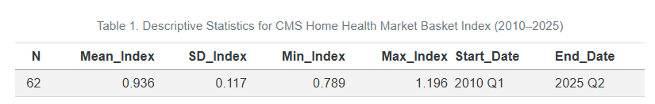

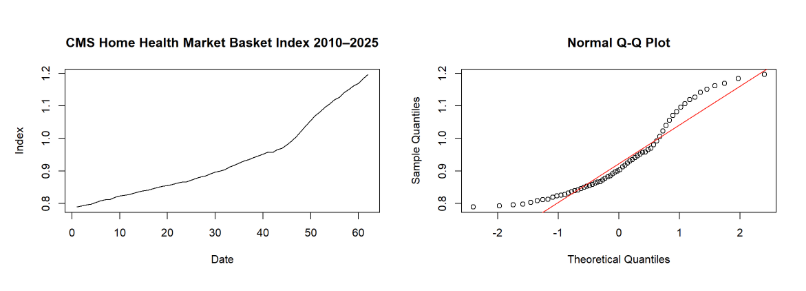

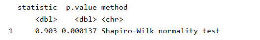

## Modeling and Results {.smaller}

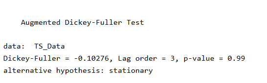

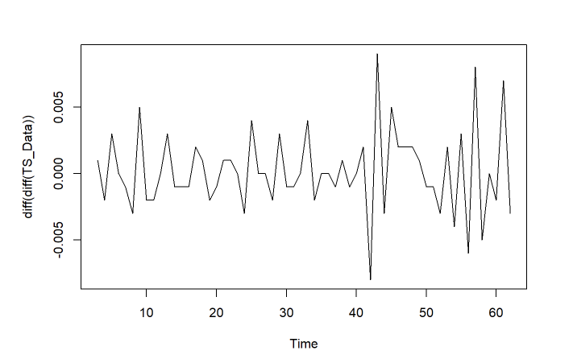

## Modeling and Results {.smaller}

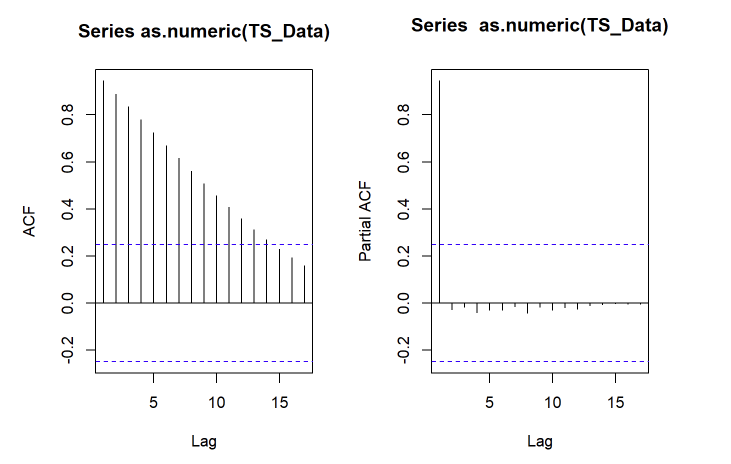

## Modeling and Results {.smaller}

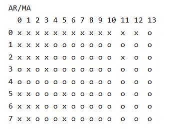

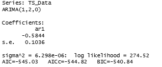


## Modeling and Results {.smaller}

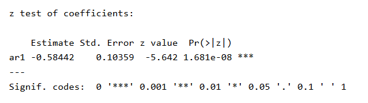{width="557"}

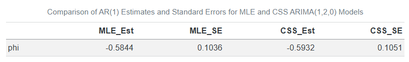{width="725"}

## Candidate Model {.smaller}

The ARIMA(1,2,0) model was selected as the most appropriate
specification based on the combined evidence from the ACF, PACF, and
EACF diagnostics. The raw series exhibited a clear upward trend, and the
slow decay in the ACF indicated non‑stationarity, supporting the need
for differencing. The PACF showed a dominant spike at lag 1 with
subsequent lags falling within the confidence bounds, consistent with an
AR(1) structure.The auto.arima() function indicated a differencing of 2
and estimated co-efficent of -0.5844 using MLE. Together, these
diagnostics pointed toward a parsimonious ARIMA(1,2,0) model that
adequately captures the underlying dependence structure of the series.

**Candidate Model**: ARIMA (1,2,0) - First order autoregressive process
with an integration of second order differencing. $$
(1 + 0.5844B)(1 - B)^2 Y_t = e_t $$

## Modeling and Results {.smaller}

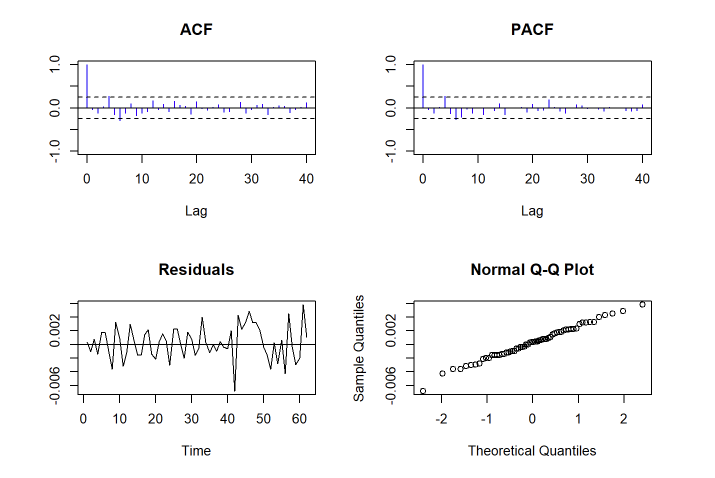

## Modeling and Results {.smaller}

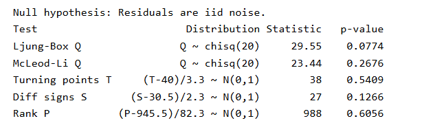

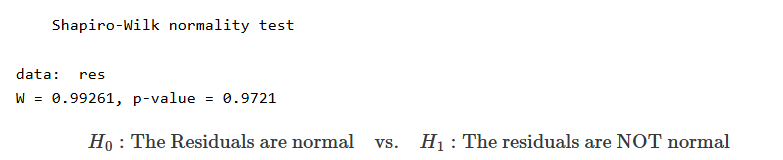

## Modeling and Results {.smaller}

All residual diagnostics support the adequacy of the ARIMA(1,2,0) model.
The Ljung–Box test indicate no remaining autocorrelation. Nonparametric
tests (turning points, difference signs, and rank tests) confirm that
the residuals behave as iid noise.

The Shapiro–Wilk test shows no evidence against normality.The p-value \>
0.5, so we fail to reject the null hypothesis, normality is not a
concern for the candidate model.

Together, these results demonstrate that the ARIMA(1,2,0) model provides
an appropriate fit for the CMS Home Health Market Basket Index.

## Results {.smaller}

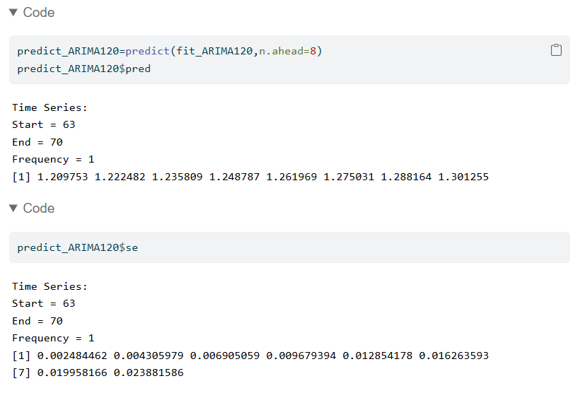

## Results {.smaller}


The ARIMA(1,2,0) model demonstrated excellent in-sample forecasting performance across all evaluation metrics. The mean absolute error (MAE=0.002) and the root mean squared error (RMSE = 0.0024), indicate that prediction errors are minimal and consistent. Additonally, the mean absolute percentage error (MAPE=0.2078%) suggesting that the forecast deviates from actual values by less than 1% on average, reflecting a very high level of accuracy. Overall, these results indicate that the model captures the underlying patterns in the data effectively.

## Conclusion {.smaller}

This study applied a classical time‑series modeling framework to evaluate and forecast the CMS Home Health Market Basket Index, a key economic indicator used to adjust Medicare reimbursement rates. After exploring the structure of the series, the ACF, PACF, and EACF diagnostics consistently indicated the presence of a strong deterministic trend and supported the need for second‑order differencing. Model identification procedures converged on an ARIMA(1,2,0) specification, which was subsequently estimated using maximum likelihood. The autoregressive parameter was statistically significant and stable across estimation methods. Comprehensive residual diagnostics including tests for autocorrelation, normality, and randomness confirmed that the residuals behaved as white noise, indicating that the model adequately captured the underlying dynamics of the series. Forecast accuracy metrics (MAE, RMSE, MAPE, MSE) further supported the model’s suitability by showing that the in sample errors were small and consistent with a well fitting ARIMA process. Taken together, these results validate the ARIMA(1,2,0) model as an appropriate and reliable tool for short‑term forecasting of the Home Health Market Basket Index, providing a sound basis for anticipating future cost‑inflation adjustments within the home health sector.

## References
